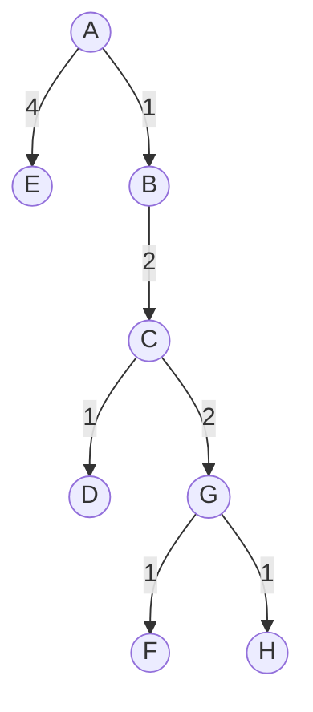
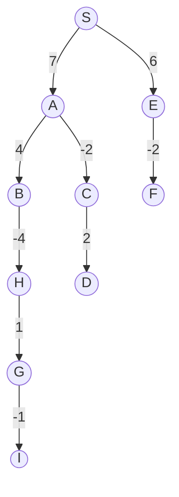

# Exercícios Graphs

## Ex. 4.1
### A)
|Interation| A | B | C | D | E | F | G | H |
|----------|---|---|---|---|---|---|---|---|
|0|0|$\infty$|$\infty$|$\infty$|$\infty$|$\infty$|$\infty$|$\infty$|
|1 (A)|0|1|$\infty$|$\infty$|4|8|$\infty$|$\infty$|
|2 (B)|0|1|3|$\infty$|4|7|7|$\infty$|
|3 \(C\)|0|1|3|4|4|7|5|$\infty$|
|4 (D)|0|1|3|4|4|7|5|8|
|5 (E)|0|1|3|4|4|7|5|8|
|6 (G)|0|1|3|4|4|6|5|6|

Obs: F e H are sinks, thus there will be 2 more interations without changes in distances.

### B)


## Ex. 4.2
### A)

Linearized Graph: S A E B C H G I F D

|Interation| S | A | B | C | D | E | F | G | H | I |
|----------|---|---|---|---|---|---|---|---|---|---|
|0|0|$\infty$|$\infty$|$\infty$|$\infty$|$\infty$|$\infty$|$\infty$| $\infty$| $\infty$|
|1 (S)|0|7|$\infty$|6|$\infty$|6|5|$\infty$| $\infty$| $\infty$|
|2 (A)|0|7|11|5|$\infty$|6|5|$\infty$| $\infty$| $\infty$|
|3 (E)|0|7|11|5|$\infty$|6|4|$\infty$| 9| $\infty$|
|4 (B)|0|7|11|5|$\infty$|6|4|9|7| $\infty$|
|5 \(C\)|0|7|11|5|7|6|4|9|7| $\infty$|
|6 (H)|0|7|11|5|7|6|4|8|7| $\infty$|
|7 (G)|0|7|11|5|7|6|4|8|7| 7|

Obs: The I, F and D interations do not change the distances.


### B)

## Ex. 4.13
### B)
O algoritmo que soluciona esse problema é similar ao de Dijkstra, com uma pequena modificação na comparação da distância e com adição de uma operação linear para encontrar a maior aresta do melhor caminho.

```
mod-diskstra(G,s)
	for all u in V:
		dist(u) = infinity
		prev(u) = False
	dist(s) = 0
	H = make-priority-queue(V) (using dist-values as keys)
	while H is not empty:
		u = deletemin(H)
		for all v in neighbours(u):
			if dist(v) > l(u,v):
				dist(v) = l(u,v)
				prev(v) = u
				decreasekey(H,v)
	return max(dist)
```
